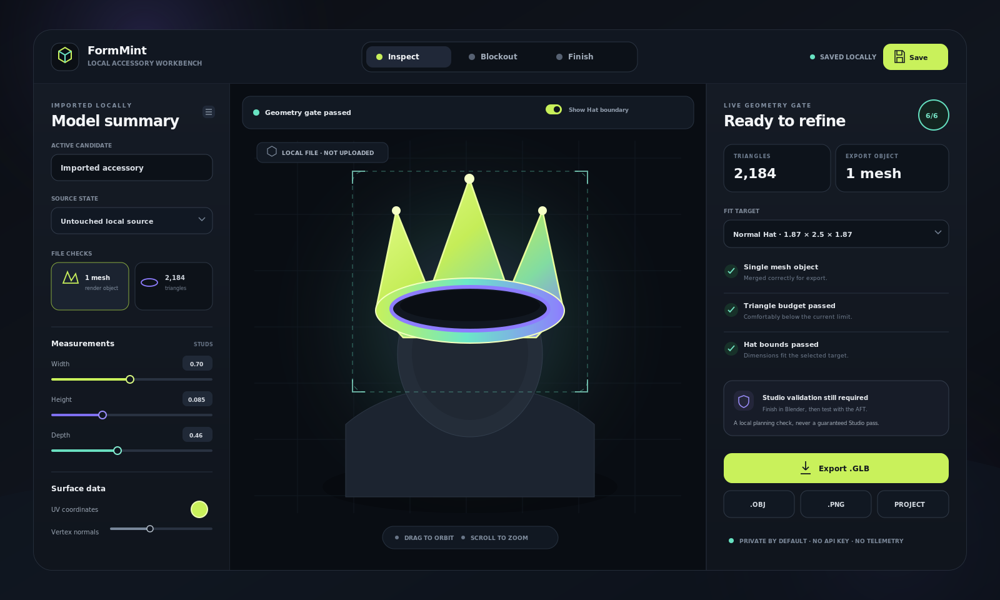

<p align="center">
  
</p>

<h1 align="center">FormMint</h1>

<p align="center"><strong>Design an original rigid avatar accessory starting mesh before spending Robux on an upload.</strong></p>

<p align="center">
  <a href="https://github.com/RepoEnjoyer/Roblox-UGC/actions/workflows/ci.yml"></a>
  <a href="LICENSE"></a>
  
  
</p>

FormMint is a local-first browser workbench for creators learning the rigid accessory workflow. It combines a procedural 3D forge, live geometry checks, project briefs, reference-sheet prompts, listing starters, an editable Robux checkpoint, and a final production checklist.

It produces a real merged `.glb` or `.obj` starting mesh. It does not pretend that a browser can replace Blender, Roblox Studio, moderation, market research, or good taste.



> The preview is illustrative. Every control and panel shown represents implemented functionality.

## What it does

- **Live procedural modelling:** Shape Crown, Halo, Orbit, and Horn silhouettes with useful limits.
- **Interactive 3D fit preview:** Orbit, zoom, pan, inspect the mannequin proxy, and show the selected Hat boundary.
- **Real geometry validation:** Check triangle count, physical dimensions, UV presence, and exposed geometric edges.
- **Single-mesh export:** Every generated component is merged into one export mesh object.
- **Local files:** Export binary GLB, OBJ, PNG previews, and portable FormMint project files.
- **Concept lab:** Turn a specific brief into a constrained multi-view reference prompt without calling an AI service.
- **Listing starter:** Generate short, natural title options and a description foundation.
- **Project shelf:** Save up to 100 variations in the current browser.
- **Robux checkpoint:** Edit current fees, price, commission, and rebate assumptions before estimating recovery.
- **Launch desk:** Track originality, Blender cleanup, Studio import, AFT fitting, avatar tests, Marketplace settings, thumbnail, and listing checks.
- **Private by default:** No account, analytics, advertising, telemetry, marketplace scraping, or application network client.

## The easiest useful workflow

1. Open **Concept** and describe one clear audience, aesthetic, palette, and silhouette difference.
2. Search the Marketplace yourself. If a recognizable existing item looks close, change the structure before modelling.
3. Open **Forge**, choose a silhouette family, and adjust it until the geometry gate has no failures.
4. Save promising variations, then export the strongest one as GLB.
5. Open the GLB in Blender. Improve proportions, resolve intersections when needed, optimize UVs, texture it, apply transforms, and confirm the final mesh is clean.
6. Import the finished `.gltf` or `.fbx` through Studio's 3D Importer.
7. Use the Accessory Fitting Tool to select the correct category, position it, test several bodies and animations, and generate the Accessory.
8. Complete the Launch checklist and confirm current official fees before submitting.

Read the detailed [Blender-to-Studio workflow](docs/blender-studio-workflow.md).

## Current rules built into the gate

The values below were verified against Roblox Creator Hub on **July 17, 2026**:

- Rigid accessories must be one mesh and cannot exceed 4,000 triangles.
- Geometry must be watertight without exposed holes or backfaces.
- Hat limits are 1.87 × 2.5 × 1.87 studs for Normal, 3 × 4 × 3 for Classic, and 1.78 × 2.5 × 1.78 for Slender.
- Marketplace textures cannot exceed 2048 × 2048.
- The final Accessory should use Plastic, Transparency `0`, default VertexColor, and no extraneous scripts or parts.
- The Accessory Fitting Tool creates the appropriate attachment for a rigid accessory. Third-party attachment import is not supported for rigid accessories.

Rules change. FormMint links directly to the official [rigid accessory specifications](https://create.roblox.com/docs/avatar/rigid-accessories/specifications), [import guide](https://create.roblox.com/docs/avatar/rigid-accessories/import), and [Marketplace policy](https://create.roblox.com/docs/marketplace/marketplace-policy). Studio and the current official documentation are always the final authority.

## Robux assumptions

As verified on July 17, 2026, Roblox documents an 80 Robux upload fee per 2D or 3D Marketplace submission and a 1,500 Robux non-limited publishing advance for Hat items. Publishing also requires the currently listed identity, security, and membership conditions. Upload fees are generally not refunded after rejection.

FormMint starts the calculator with those Hat values, but every number is editable. The estimate is not a promise of sales or profit. It excludes demand, moderation risk, taxes, escrow timing, price-floor changes, and future policy changes. Confirm the [current fees and commissions](https://create.roblox.com/docs/marketplace/marketplace-fees-and-commissions) immediately before publishing.

## Quick start

Requirements: [Node.js](https://nodejs.org/) 20.19 or newer and npm.

```bash
git clone https://github.com/RepoEnjoyer/Roblox-UGC.git
cd Roblox-UGC
npm ci
npm run dev
```

Open the local address shown by Vite.

For a production build:

```bash
npm run build
npm run preview
```

The static output is written to `dist/`. The relative asset base supports normal static hosting and subdirectory deployments.

## Commands

| Command | Purpose |
| --- | --- |
| `npm run dev` | Start the local development server |
| `npm run typecheck` | Run strict TypeScript checks |
| `npm run lint` | Check source and configuration files |
| `npm test` | Run the Vitest suite once |
| `npm run build` | Type-check and create a production bundle |
| `npm run check` | Run lint, types, tests, and build together |

## Important limitations

- FormMint outputs a **starting mesh**, not a guaranteed Marketplace-ready product.
- Generated components are merged into one mesh object but may intersect. Inspect and clean the result in Blender.
- Primitive UVs are retained but are not an artist-finished texture layout.
- The mannequin and boundary are planning aids. The Studio Accessory Fitting Tool is the fit authority.
- FormMint does not create layered clothing, body bundles, dynamic heads, attachments, PBR textures, or direct Marketplace uploads.
- It does not search trends or claim that an item will sell.
- Browser storage is not encrypted and stays with the current browser profile.

## Privacy and intellectual property

Projects remain in browser local storage unless you export them. FormMint contains no runtime request to Roblox, an AI provider, or any analytics service. Opening an official documentation link is an explicit user action.

The prompt builder forbids brands, logos, copyrighted characters, and close copies, but text cannot guarantee originality. You remain responsible for Marketplace searches, ownership, commercial-use rights, moderation compliance, and substantial creative work. See [PRIVACY.md](PRIVACY.md) and [SECURITY.md](SECURITY.md).

FormMint is an independent tool and is not endorsed by or affiliated with Roblox Corporation. Roblox and related marks belong to their respective owner.

## Documentation

- [Blender and Studio workflow](docs/blender-studio-workflow.md)
- [Technical and trust boundaries](docs/technical-boundaries.md)
- [Roadmap](ROADMAP.md)
- [Contributing](CONTRIBUTING.md)
- [Security policy](SECURITY.md)
- [AI developer handoff](AI_HANDOFF.md)
- [Changelog](CHANGELOG.md)

## License

Released under the [MIT License](LICENSE). Copyright (c) 2026 RepoEnjoyer.
